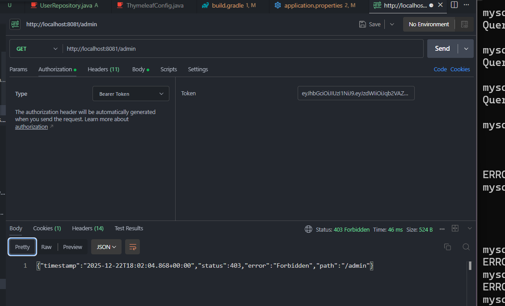

# Spring Security Implementation Progress Report

**Name**: Hak Sengkea



---

## Project Overview

This project implements a secure session management system using Spring Boot 3.3.5 with Spring Security and JWT (JSON Web Token) authentication. The system manages user roles (Admin, Chair, Attendee) with role-based access control.

---

## Implementation Progress


**Implementation Details:**
- Configured JWT-based stateless authentication
- Implemented role-based authorization for three user types:
  - `ADMIN` - Access to `/admin/**` endpoints
  - `CHAIR` - Access to `/chair/**` endpoints
  - `ATTENDEE` - Access to `/attendee/**` endpoints
- Disabled session management (STATELESS mode)
- Configured CORS to allow all origins
- Set up custom authentication entry point for unauthorized access
- Integrated JWT filter before UsernamePasswordAuthenticationFilter

---

## Security Features Implemented

### Authentication
- JWT-based authentication
- Stateless session management
- BCrypt password hashing
- Email-based user identification

### Authorization
- Role-based access control (RBAC)
- Method-level security annotations
- Endpoint protection by role
- Custom authentication entry point

### API Security
- CORS configuration
- CSRF protection (disabled for REST API)
- Custom error responses
- Token expiration handling

---

## API Endpoints

### Public Endpoints
- `POST /api/auth/login` - User login
- `POST /api/auth/register` - User registration

### Protected Endpoints
- `/admin/**` - Requires ADMIN role
- `/chair/**` - Requires CHAIR role
- `/attendee/**` - Requires ATTENDEE role

---


## Testing Progress

**Completed:**
- ✅ Manual API testing using REST client
- ✅ Login endpoint tested successfully
- ✅ JWT token generation verified
- ✅ Token format: Bearer token in Authorization header

**Tested Scenarios:**
- User login with valid credentials
- JWT token generation and return
- Response format validation

**Pending:**
- Role-based endpoint access testing
- Registration endpoint testing
- Token expiration testing
- Invalid credentials handling
- Automated unit tests
- Integration tests

---
## Learning Outcomes

Through this project, the following concepts were learned and applied:

### Spring Security Concepts
1. **Authentication vs Authorization**
   - Understanding the difference between verifying identity and granting permissions

2. **JWT Token-Based Authentication**
   - Stateless authentication mechanism
   - Token generation, validation, and expiration
   - Bearer token format and transmission

3. **Password Security**
   - BCrypt hashing algorithm
   - Salt generation with SecureRandom
   - Password strength configuration

4. **Role-Based Access Control (RBAC)**
   - Defining user roles and authorities
   - Protecting endpoints based on roles
   - Method-level security annotations

---

## Next Steps


### Future Enhancements
1. ⏳ Implement refresh token mechanism
2. ⏳ Add password reset functionality
3. ⏳ Implement email verification
4. ⏳ Add account activation/deactivation
5. ⏳ Integrate Thymeleaf for UI
6. ⏳ Write comprehensive unit tests
7. ⏳ Add API documentation (Swagger/OpenAPI)
8. ⏳ Implement rate limiting
9. ⏳ Add logging and monitoring

---

my dependency
```    // Spring Boot starters (keep these)
    implementation 'org.springframework.boot:spring-boot-starter-security'
    implementation 'org.springframework.boot:spring-boot-starter-web'
    implementation 'org.springframework.boot:spring-boot-starter-data-jpa'
    // ... your other starters

    // Explicit Spring Security modules (required for advanced features)
    implementation 'org.springframework.security:spring-security-config'
    implementation 'org.springframework.security:spring-security-web'

    // JWT (JJWT) - required for JwtUtil and JwtFilter
    implementation 'io.jsonwebtoken:jjwt-api:0.12.6'  // Latest stable
    runtimeOnly 'io.jsonwebtoken:jjwt-impl:0.12.6'
    runtimeOnly 'io.jsonwebtoken:jjwt-jackson:0.12.6'  // JSON parser (or use jjwt-gson)

    // Lombok (ensure annotation processing)
    compileOnly 'org.projectlombok:lombok:1.18.34'  // Latest
    annotationProcessor 'org.projectlombok:lombok:1.18.34'
    testCompileOnly 'org.projectlombok:lombok:1.18.34'
    testAnnotationProcessor 'org.projectlombok:lombok:1.18.34'
   ```
