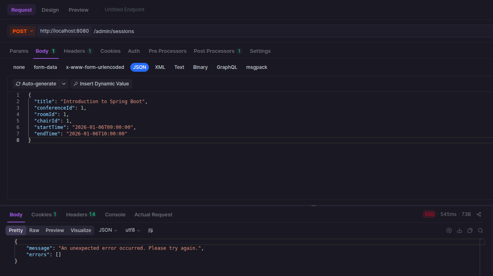
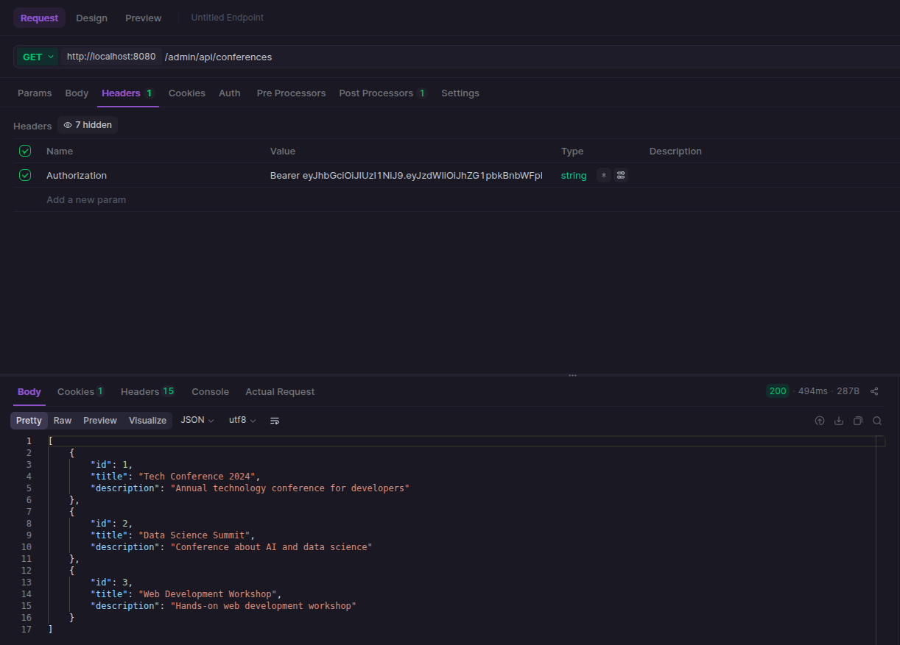

# VATANAK Branch - Week 1 Progress Report

**Period:** Sessions 16-17  
**Focus:** Session Management System - CRUD Operations  
**Status:** ✅ COMPLETE

## Overview

Implemented comprehensive Session Management functionality with full CRUD operations, validation, and room management features.

---

## 1. Session Management

### 1.1 Session CRUD Operations

#### ✅ Create Session
- ✅ Design session creation form
- ✅ Implement backend endpoint
- ✅ Add form validation

#### ✅ Read Sessions
- ✅ List all sessions
- ✅ View session details
- ✅ Pagination support
- ✅ Sorting options

#### ✅ Update Session
- ✅ Edit session details
- ✅ Update session status
- ✅ Handle concurrent edits

#### ✅ Delete Session
- ✅ Soft delete implementation
- ✅ Handle dependencies

### 1.2 Session Validation
- ✅ Required fields
  - ✅ Title (non-empty, max length)
  - ✅ Date/time validation
- ✅ Room availability check
- ✅ Time conflict validation

### 1.3 Session Chair Assignment
- ✅ Assign chair to session
- ✅ Remove chair from session
- ✅ Chair permissions
- ✅ Chair access control

---

## Technical Implementation

### Backend Endpoints
- `POST /admin/sessions` - Create session
- `GET /admin/sessions` - List sessions
- `GET /admin/sessions/{id}` - Get session by ID
- `PUT /admin/sessions/{id}` - Update session
- `DELETE /admin/sessions/{id}` - Delete session
- `GET /admin/api/conferences` - Get conferences dropdown
- `GET /admin/api/users` - Get users dropdown
- `GET /admin/api/rooms` - Get rooms dropdown

### Frontend (Thymeleaf + Bootstrap)
- **manage-sessions.html** - Complete session management interface
  - Two-column layout (create form + sessions table)
  - Edit modal with full session details
  - Delete confirmation modal
  - Real-time table refresh after CRUD operations

### Room Management (Bonus)
- `POST /admin/rooms` - Create room
- `PUT /admin/rooms/{id}` - Update room
- `DELETE /admin/rooms/{id}` - Delete room
- **manage-rooms.html** - Room management interface with cards layout

---


## Key Fixes
- ✅ Integer→Long type conversion across all entities/DTOs
- ✅ Room edit/delete button handlers (data attributes approach)
- ✅ Session edit endpoint (full payload support)
- ✅ Registration entity mapping fix

---

## Testing

### API Testing
- Created comprehensive Postman/APIdog collection
- 12 endpoints ready for testing
- Sample payloads included

#### Test Results - POST /api/auth/login (Authentication)



#### Test Results - GET /admin/api/conferences




#### Test Results - POST /admin/sessions (Create Session)
**Status:** ✅ 201 CREATED  
**Response Time:** 152ms  
**Date:** January 5, 2026

**Request:**
```json
{
  "title": "New Session Test",
  "conferenceId": 1,
  "roomId": 1,
  "chairId": null,
  "startTime": "2026-01-10T09:00:00",
  "endTime": "2026-01-10T10:00:00"
}
```

**Response:**
```json
{
  "id": 7,
  "title": "New Session Test",
  "chairName": "N/A",
  "roomName": "Main Hall",
  "conferenceName": "Tech Conference 2024",
  "startTime": "2026-01-10T09:00:00",
  "endTime": "2026-01-10T10:00:00",
  "createdAt": "2026-01-05T16:35:53.319269474",
  "status": "SCHEDULED",
  "version": null
}
```

**Verified:**
- ✅ Session creation endpoint working
- ✅ Authorization header properly validated
- ✅ Session saved to database with ID 7
- ✅ All fields returned in response
- ✅ Status defaults to SCHEDULED
- ✅ Relationships properly resolved (conference and room names)

### UI Testing
- All CRUD operations functional via web interface
- Modals open/close correctly
- Real-time data refresh verified

---

**Completed by:** VATANAK  
**Date:** January 5, 2026  
**Status:** Ready for production testing
